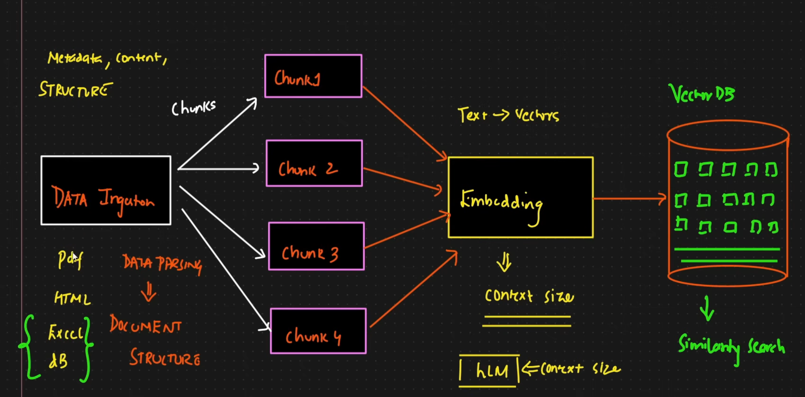

Data Retrival Pipeline:

Why PyMuPDF

Three practical reasons for your case:

Speed. It's noticeably faster than pdfplumber or PyPDF on large files. Your Reliance PDF is 174 pages and 8.8 MB — you'll be re-running extraction many times as you iterate on chunking, so this matters more than it sounds.

Better metadata. It returns creation date, producer, creator, title, total pages. pdfplumber and PyPDF give you less. That metadata goes into your chunks.

Layout awareness. It can return text with position coordinates, detect blocks, and identify text vs images. You don't need that today, but you will when you get to multi-column pages and tables.

The honest caveat: the production guide you read recommends Unstructured.io or LlamaParse over any of these for layout-aware parsing. Those are better at tables and multi-column, but they're heavier — one needs API calls, the other has a big dependency tree. PyMuPDF is the right middle ground for learning: fast, local, free, and you can see exactly what it's doing.

For comparison, pdfplumber is genuinely better at table extraction specifically. When you get to v3, you may well use both — PyMuPDF for text, pdfplumber for tables. That's a real, defensible architecture decision worth logging.
